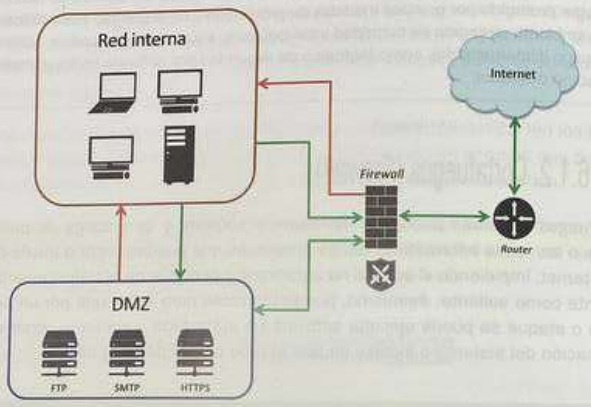

# Seguridad en las redes informáticas
- Preservar integridad (que no se pierda información)
- Preservar la disponibilidad
- Preservar la privacidad
- Medidas activas: detectar amenazas y generar una acción
- Medidas pasivas: reducir el impacte del ataque (ej.: back-up)
## Control de acceso
- Se puede limitar el acceso a ciertos usuarios a ciertos equipos de una red, de equipos a la red, ejecución de ciertos comandos, etc.
- Medidas de control de acceso físico, doble firewall...
## Cortafuegos
- Hardware o software
- Protege la red de accesos no autorizados
- Impide accesos no autorizados y permite accesos autorizados
### Cortafuegos hardware
- Dispositivo que se coloca entre la red interna y la externa
- DMZ (Zona Desmilitarizada): red dentro de una red aislada del resto de la red
- Se puede conectar con el exterior, pero no con la red interna que está fuera de su zona
- Los equipos de dentro de la red pueden conectarse con la DMZ

### Cortafuegos software
- Cortafuegos en Linux
  - 'ufw' (Uncomplicated Firewall)
- Cortafuegos en Windows
  - Firewall y protección de red
  - 'Windows Defender Firewall'
    - Estado: activado/desactivado
    - Conexiones entrantes: bloquear/permitir
    - Redes privadas y públicas o invitadas
    - Estado de notificación: si el usuario quiere recibir una notificación cuando se bloquee la aplicación
    - Aplicaciones permitidas
    - Configuración avanzada:
      - Reglas para cada tipo de red
    - Comandos:
      - `netsh advfirewal`: configura el firewall desde comandos
      - `netsh advfirewall show allprofiles`: muestra todas las reglas
      - `Get-NetFirewallProfile`: muestra el estado de los perfiles del firewall
## Sistemas de detección de intrusión
- Herramientas que motirozian y detectan intrusiones:
  - IDS (Intrusion Detection System): detecta accesos no autoriados a equipos o redes
  - IPS (Intrusion Prevention System): detecta y bloquea accesos no autorizados
  - SIEM (Security Information and Event Management): recopila y analiza información de seguridad
- Otras buenas medidas:
  - Comprobar los ficheros de `log` del sistema
  - Filtrado de direcciones MAC
  - Ocultar la SSID
  - Mantener actualizado el sistema
## Herramientas de cifrado y seguridad
- OpenSSL: herramientas TLS y SSL y criptofrafía
- LibreSSL:
  - Bifurcación de OpenSSL
  - `libcrypto`, `libssl` o `libtls`: bibliotecas de criptografía y utilidades para TLS
- `openssl req`: generar certificados
### OpenSSH
- Paquete que ayuda a la seguridad ofreciento la herramienta SSH y otras aplicaciones para cifrar las comunicaciones en una red
- También ofrece `ssh-keygen`: genera claves SSH
### Certificados
- Se usan para autenticar la identidad de un servidor
- La mayoría se basan en el estándar X.509 v3 
- Para obtener un certificado, hay que acudir a una entidad certificadora (CA) autorizada
- Utilidades:
  - Autenticación del sitio web
  - Cifrar comunicación
  - Garantizar la integridad del documento firmado
- Generan clave pública y privada
### Comprobación de certificados instalados en Windows
- `certmgr.msc`: muestra los certificados del usuario actual
- `certlm.msc`: muestra los certificados de la máquina local
### Comprobación de certificados instalados en Linux
- Se encuentran en `/etc/ssl/certs` junto con el fichero `ca-certificates.crt`
### Let's Encrypt
- Herramienta con la que se puede conseguir un certificado difital de forma gratuita
- Es una CA
- Válido para usarlo en la web con el protocolo HTTPS
## Configuración del router
- Necesario conocer IP, usuario y contraseña
- En LAN pequeñas: 192.168.1.1 o 192.168.0.1
- Medidas de seguridad:
  - Cambiar la contraseña predeterminada
  - Ocultar la SSID
  - Cambiar la contraseña del Wi-Fi
  - Utilizar el cifrado más seguro posible
  - Filtrar direcciones MAC
  - Desactivar el WPS si no se usa
  - Actualizar el firmware
  - Abrir solo los puertos necesarios
- `traceroute`: muestra la ruta que sigue un paquete de datos, routers por los que pasa y si hay un fallo (`tracert` en Windows)
# Recursos compartidos
## Identificación de los equipos dentro de una red
- Cada equipo tiene una dirección IP y nombre únicos
- Nombres: 15 caracteres máximo (no espacio ni caracteres especiales)
- Se añaden a un grupo de trabajo o a un dominio
  - Grupos: no cuenta de administrador
  - Dominios: cuenta de administrador
- Los grupos de trabajo son más útiles en redes locales pequeñas
  - La administración se hace en cada equipo
  - Todos los equipos se conectan entre sí
- Dominios
  - Un servidor controla la red
  - Hay una BBDD de los servicios de dominio y un servidor como Active Directory en Windows o LDAP en Linux
  - Los usuarios pueden iniciar sesión en cualquier equipo configurado para ello
  - Los equipos pueden tener un nombre de host o un nombre de dominio completo o FQDN (Fully Qualified Domain Name)
## Conexión de ordenadores en red
- `ping`: comprueba la conexión entre dos equipos
  - En Linux se corta con Ctrl+C
  - En Windows son 4 por defecto
  - Desde PowerShell:
    - `Test-Connection -ComputerName <nombre> -TraceRoute`
    - `Test-Connection -ComputerName <nombre> -Port <puerto>`
## Compartición de recursos en red
### Windows
- Para ver los recursos disponibles en la red se selecciona Red dentro del explorador de archivos
- Para comprobar el estado de la detección de redes y recursos compartidos: Panel de control > Centro de redes y recursos compartidos > Cambiar configuración de uso compartido avanzado
- Se puede configurar en cada red
- Para las carpetas públicas se puede activar el uso compartido para todas las redes
- Se puede compartir con protección por contraseña
- Compartir carpeta: Propiedades > Compartir > Uso compartido de carpetas y archivos en red > Elegir usuarios y grupos
- Línea de comandos: `net share`
### Linux
- Se puede compartir con Samba
  - Implementación del protocolo SMB en Linux
  - Para compartir archivos e improsar en una red local
- Se puede compartir con NFS
  - Protocolo de sistema de archivos de red
  - Permite a los sistemas conectarse a un sistema de archivos remotoPuede integrarse con Active Directory de Windows
- Configuración > Compartir > Crear compartición
- Hay que añadir un nombre para el recurso, un comentario opcional y marcar las opciones oportunas
- El acceso de invitado debe dejarse desactivado por seguridad
#### Servicios de Samba en Linux
- Se pueden crear usuarios de Samba y acceder desde otro equipo Linux
# Listas de control de acceso
- Sirven para ampliar el control sobre los permisos asignados y el acceso de los usuarios a diferentes recursos
- Tanto locales como a través de la red
- Pueden ser:
  - DACL (Discretionary Access Control List): indica qué usuarios y grupos pueden usar un objeto y con qué permisos
  - SACL (System Access Control List): indica qué accesos al objeto serán utilizados por el sistema
## Linux
- En primer lugar hay que comprobar que `acl` esté habilitado (normalmente lo está en ext4)
- `getfacl <fichero>`: obtiene la ACL de un fichero o directorio
- `setfacl`: modifica o elimina la ACL de un fichero o directorio
## Windows
- El sistema de archivos debe ser NTFS
- Se gestiona en Seguridad de la `Carpeta > Avanzado`
- `icacls`: crea, muestra o modifica la lista de control de acceso DACL de un fichero o carpeta
  - También puede realizar copias de las mismas y restaurarlas
# Acceso remoto
## Escritorio remoto
- Permite controlar un equipo de forma remota de modo gráfico
- Windows: RDP (Remote Desktop Protocol) (XRDP en Linux)
- Linux: VNC (Virtual Network Computing)
### RDP
- Se activa en `Configuración > Sistema > Escritorio remoto`
- Para conectar desde Windows al escritorio remoto en Linux hay que configuarar el firewall de Linux (`ufw`) e instalar `XRDP`
- Se puede elegir el tamaño del escritorio y la profunidad del color (ligereza vs calidad)
- También: recursos locales, optimizar rendimiento, autentificación de la conexión...
### VNC
- Se puede instalar también en Windows
- Opciones: RealVNC, TightVNC, UltraVNC y TigerVNC
- Todo programa de escritorio remoto tiene una parte de servidor (VNC Server) y una parte de cliente (VNC Viewer)
## Conexión remota
- Conexiones de solo texto
- Más recomendable ya que es más rápido
- También porque puede que el servivor al que se quiere acceder no tenga un entorno gráfico
### Telnet
- Trabaja sobre la capa de aplicación del protocolo TCP/IP
- Puerto 23 por defecto
- Solo modo texto
- Información no cifrada
- No recomendado
  - Cuando no sea importante la seguridad para acceder de forma rápida
### SSH
- Trabaja sobre la capa de aplicación del protocolo TCP/IP
- Puerto 22 por defecto
- Conexión segura y cifrada
- Necesario tener instalado, en funcionamiento y permitiendo el acceso el cortafuegos del servidor SSH
- En Linux se instala el paquete OpenSSH
- También se puede acceder desde un equipo Windows com el comando `ssh`
- O desde otro eqipo Linux con `ssh` o Remmina, marcando la opción de SSH y el nombre del equipo o dirección IP a la que acceder
### Aplicaciones para acceso remoto
#### PuTTy
- Cliente SSH, Telnet y Rlogin
- Para Windows
- En Session se introduce la dirección IP o nombre del equipo y el puerto
- En Connection > SSH > Auth se introduce el usuario
- Si se va a acceder más veces se puede asignar un valor a la sesión y guardarla
- Accept: añade la clave a la lista de claves conocidas
- Connect Once: no guarda la clave, para cuanndo no hay confianza
## Copias remotas
- Se utilizan para realizar copias de archivos en equipos remotos o copiar archivos desde un equipo remoto
- Utilidades:
  - `rsync`: realiza copias rápidas en carpetas remotas y locales
    - Es el comando que ha sustituido a RCP (Remote File Copy)
  - `scp`: copia archivos de forma segura entre equipos utilizando SSH
    - Preguntará si se desea añadir la clave a la lista de claves conocidas
# Práctica guiada de EC2
# Práctica Windows Server